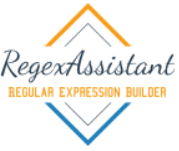
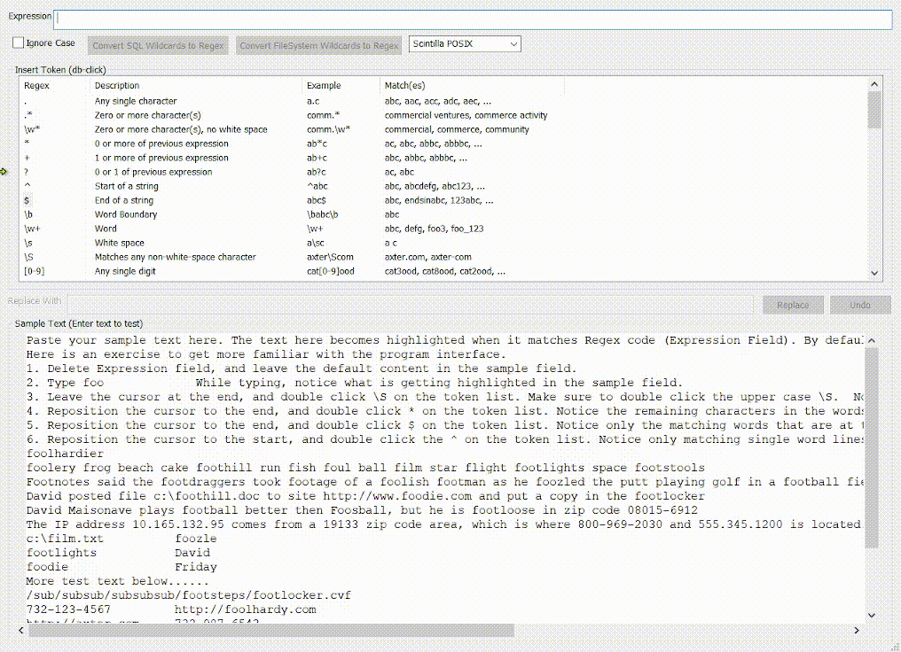

# RegexAssistant

RegexAssistant is an open source Regular Expression (Regex) find and replace tool for Windows. 
It has an easy to use UI that can build and test regex, and the results are seen real time as expression is typed into the GUI.
It has a cheat-sheet token window which list the main regex tokens and common patterns. Items in the token list can be inserted into the Expression (regex) field by double clicking the desired token.

## Downloads
Use the following link to download the latest release binaries: [Download](https://github.com/David-Maisonave/RegexAssistant/releases/latest)
## Features

#### Real time results
The results are displayed in real time to quickly let the user see when an expression is working, and exactly when it stops working.
#### Compatibility Option
The compatibility option allows the user to select the target regex implementation to display results for.
Currently available targets are Boost, Scintilla, POSIX, STD Regex, Perl, and SED.
#### Regex Replace
Regex replace is supported when compatibility is switch to boost or STD types. The token list has example regex replacement patterns at the bottom of the list.
These patters can help the user to quickly test there replace expression, and user can easily undo the results by clicking the Undo button.
#### Cheat-sheet (Token List)
A list window displays the regex tokens
The first column displays the token itself.  The second column gives a description.
The Third column gives example usage, and the last column displays matches for the examples.

When the user double clicks a token in the first column, the token gets inserted into the expression at the cursor position.

##### Cheat-sheet Common Patterns
The token window list many common patterns that the user can use just by double clicking on the desired patterns.
Here's a list of just a few of the many patterns that are listed.
##### Phone pattern
##### IP pattern
##### Date pattern
##### Time patterns
##### Zip code pattern
##### URL pattern
##### Major credit card pattern
##### File name pattern
##### Social Security Number pattern
##### Error reporting pattern
##### GUID pattern

#### Convert FileSystem and SQL Wildcards to Regex
##### Convert FileSystem
This option is for users who are more familiar with windows file system wildcards (*?).
It allows the user to convert an expression using the file system wildcards into a regex expression, using regex wildcards.
##### Convert SQL
This option is for users who are more familiar with SQL wildcards (%_#*?).
It allows the user to convert an expression using the SQL wildcards into a regex expression, using regex wildcards.

## RegexAssistant Build Instructions
### Summary
RegexAssistant can be built using Visual Studio (2017 or 2019) with the solution file RegexAssistant.sln.
It requires 2 external libaries (Boost and Scintilla). These 2 libraries are **not** included in the repository.

#### Visual Studio Requirement
##### Visual Studio 2017
 * *Community*, *Professional* or *Enterprise* Edition
 * VC++ 2017 v141 toolset
 * Windows XP support for C++
 * MFC and ATL support
 * Windows 10 SDK
##### Visual Studio 2019
 * *Community*, *Professional* or *Enterprise* Edition
 * MSVC v142 Buildtools
 * C++ MFC for v142 Buildtools
 * Windows 10 SDK

#### External libaries (Boost and Scintilla)
1. Download [Boost version 1.77](https://www.boost.org/users/download/) or greater. Extract the boost folder and save it to the same location as the solution (**RegexAssistant.sln**) file. Rename the folder from **boost_1_77_0** to **boost**.
2. Download [Scintilla version 5.1.1](https://www.scintilla.org/scite511.zip) or greater. Extract only the **scintilla** folder, and put it at the same locations as the solution (**RegexAssistant.sln**) file.

The RegexAssistant folder should look like the following:

#### Build Solution
Open the solution using Visual Studio, and press the F7 key to build the solution.

